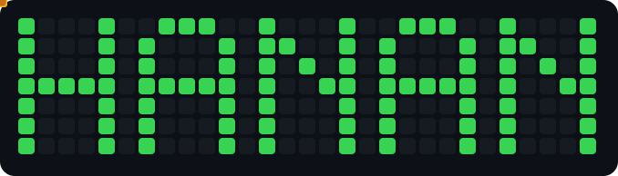
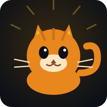

<div align="center">



</div>

<br>

<div align="center">

<a href="https://git.io/typing-svg">
  
</a>

</div>

```yaml
> user:      hannansaeed (Xcthine)
> role:      CyberSecurity Researcher / Mobile & Web Developer / DevSecOps
> focus:     on-device threat detection, secure mobile architecture, offensive security
> currently: 🚧 heads-down building Cyfex
> reading:   always something
> fun_fact:  I'd rather find the bug than write the changelog
```

<br>

<div align="center">

### 🐱 mood: retro



</div>

<br>

## 🛠️ Tech Stack

<div align="center">

<br/>


</div>

<br>

## 🔗 Connect

<div align="center">

[](https://www.linkedin.com/in/hanan-saeed/)


</div>
